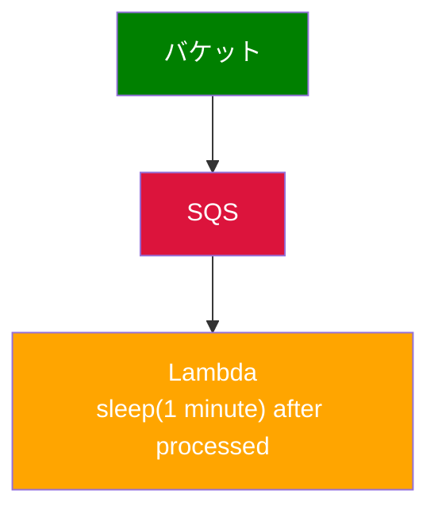

```mermaid
graph TD
    A[バケット] --> B[SQS]
    B --> C["Lambda<br/>sleep(1 minute) after processed"]
    
    style A fill:#008000,color:#ffffff
    style B fill:#dc143c,color:#ffffff
    style C fill:#ffa500,color:#ffffff
```
