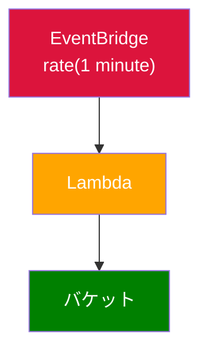

```mermaid
graph TD
    A["EventBridge<br/>rate(1 minute)"] --> B[Lambda]
    B --> C[バケット]
    
    style A fill:#dc143c,color:#ffffff
    style B fill:#ffa500,color:#ffffff
    style C fill:#008000,color:#ffffff
```
